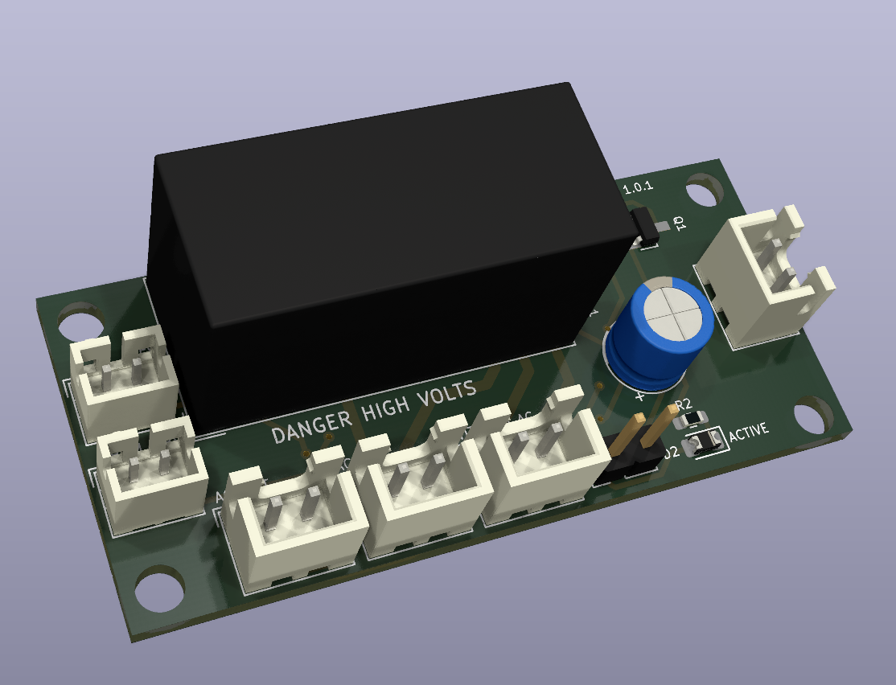

# AC Relay

This board is the main AC entry point for the amplifier.  Here is branches out into two unswitched AC JST-XH connections for the digital power supply and
the operational amplifier supply.  There is another switched JST-XH connection for the toroid transformer that the microprocessor can control.  When the amplifier is "on", the microprocessor will close the relay, connection the toroid to the AC mains. This will energize and the capacitor bank and provide power to all five channel amplifiers.  When the amplifier is "off", the microprocessor will release the relay, disconnecting the toroid from the AC mains.  

## Version History

- 1.0: Initial Release

## Speciality Components

* G2RL-2-HA DC5 relay
* JST-XH PCB connectors

