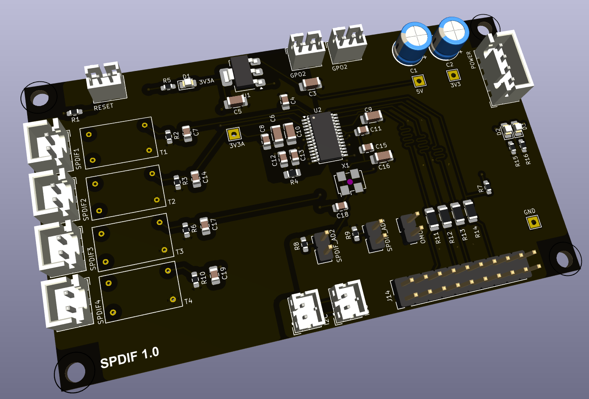

## Subwoofer

This PCB generates a subwoofer signal from the left and right channels. A jumper is available to pass the left and right channels directly, or to filter out the 
bass being sent to the subwoofer as well.  The current crossover frequency is set to 80 Hz.

### Version History

- 1.0: Initial Release