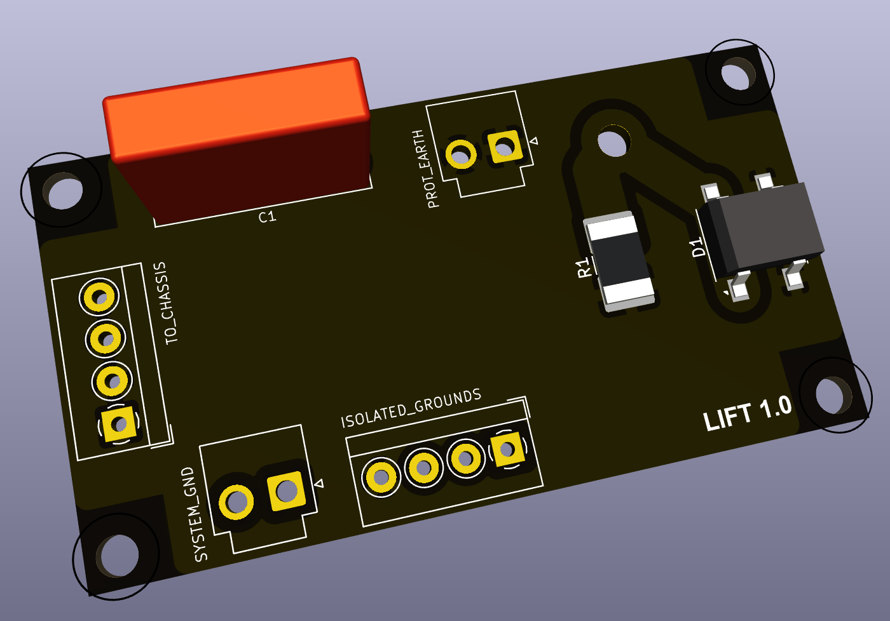

# Microprocessor Board

The heart of the amplifier is this microprocessor board based on the ESP32 WROOM 32 IC.

## Version History

- 1.0: Initial Release
- 1.1: Addressed issue with ESP32 programming transistors
- 1.2: Added missing pull-down resistor for relay/softstart 

## Speciality Components

* ESP32 WROOM 32
* FT232RL USB to UART converter
* TMP100 temperature sensor

