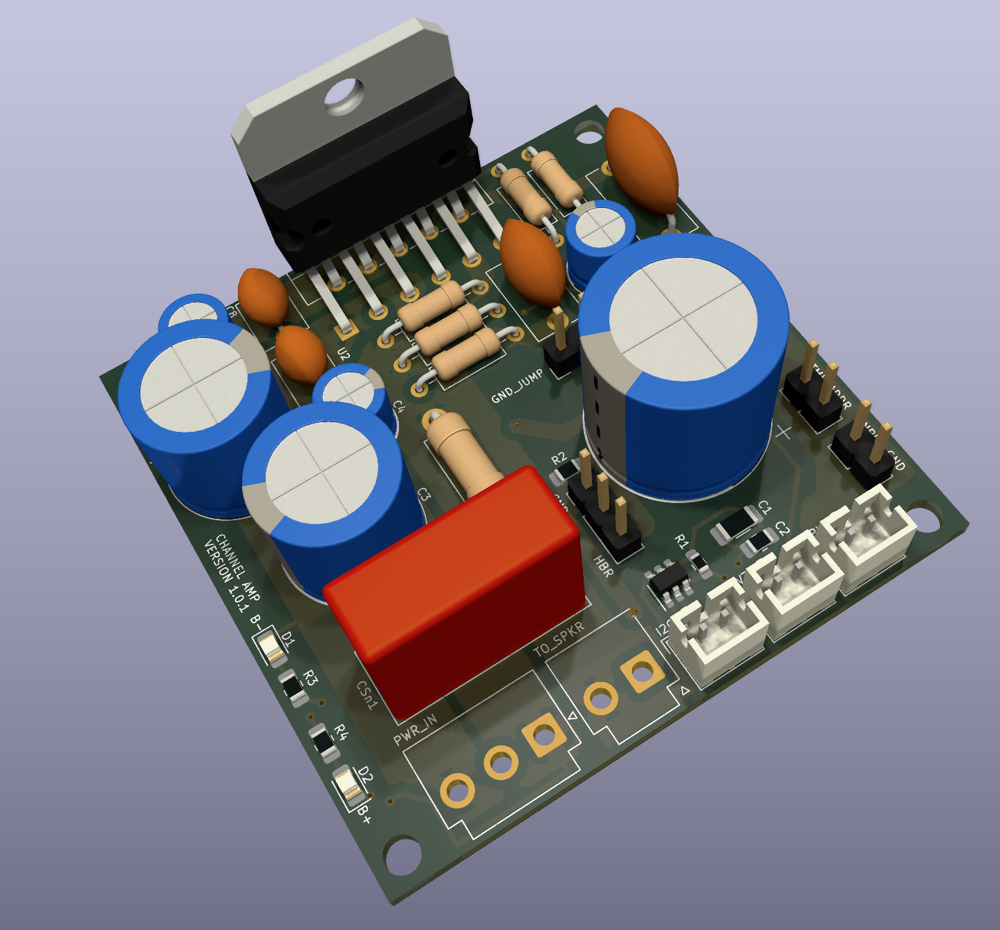

# LM3886 Channel Amplifiers

The LM3886 has a somewhat mythical status ever since a $3,000 gaincard was released in 1999.  It had amazing sound quality, but inside was only a tweaked LM3886 Texas Instrument 68W amplifier IC.  Since then, an entire community has evolved around these 'gainclones', which truly are hi-fidelity.  This project uses 5 of these, along with a Dolby Decoder IC, to create a complete DIY hi-fidelity 5.1 system.

## Version History

- 1.0: Initial Release
- 1.1: Improved layout
- 1.2: Changed erroneous capacitor size

## Speciality Components

* LM3886 68W channel amplifier ICs
* 680pF, and 47pF silver mica capacitors
* 4.7uF X7R 50V caps
* 10uf Nichicon Muse ES
