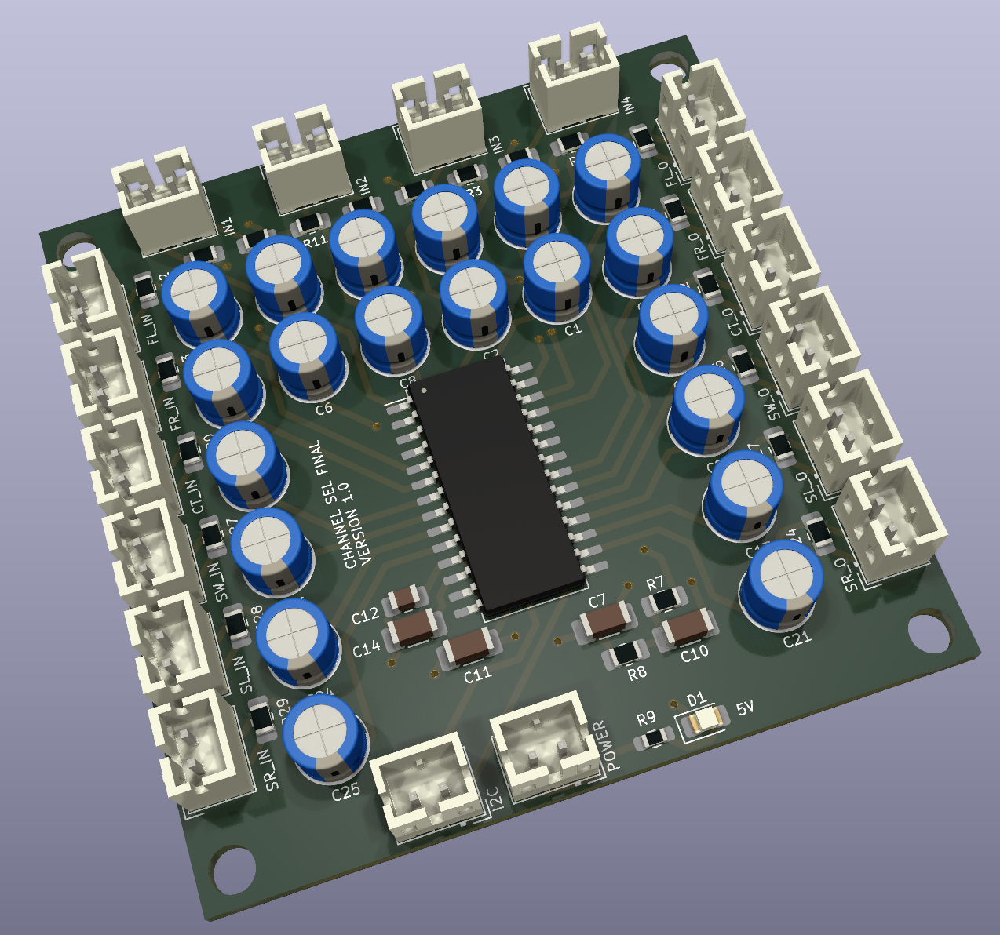

# Channel Selector

This PCB allows switching of 4 analog stereo inputs and one 5.1 channel input into 5.1.  Channels that are missing
can be created.  It is based on the AX2358 IC.

## Version History

- 1.0: Initial Release

## Speciality Components

* AX2358 Channel switching IC
* Nichicon Muse ES 25V 10uF
