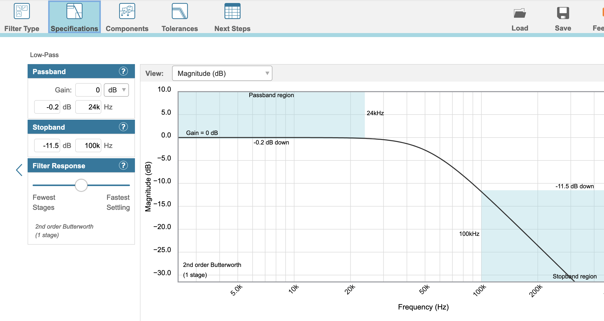
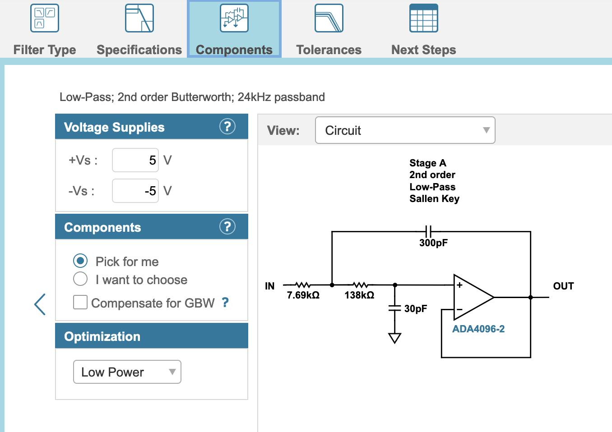

# DAC Filters

The output from the DAC board contains some residual noise that needs to be filtered out, which is the purpose of this board.  It utilizes three dual op-amps 
set up as active filters, one for each channel. 

## Version History

- 1.0: Initial Release

## Speciality Components

* OPA2134 Burr Brown operation op-amps or equivalents
* 300pF and 30pF C0G 1206 capacitors
* 7.5K and 130K thin film 1206 capacitors

## Filter Design

Texas Instruments recommends a simple first order active Sallen Key filter to reduce the level of post-DAC noise in the audio stream.

I used an online filter designer, setting a 1dB drop at 24kHz, with a stopband of -18dB at 100kHz.  These were chosen iteratively to try and keep the passband
relatively flat, and the gain as large as possible while still being a second order filter.  The final design has a 3dB corner frequency of 34.2kHz.

