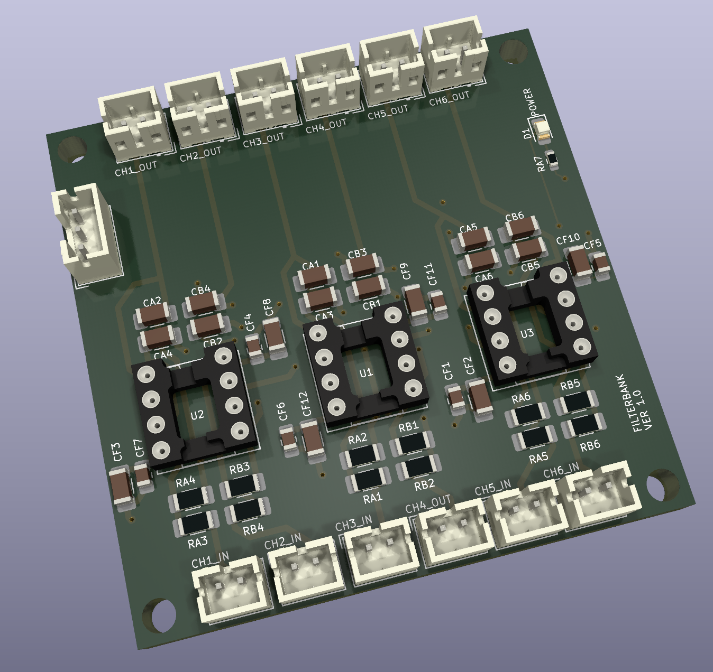

# DAC Filters

The output from the DAC board contains some residual noise that needs to be filtered out, which is the purpose of this board.  It utilizes three dual op-amps 
set up as active filters, one for each channel. 

## Version History

- 1.0: Initial Release

## Speciality Components

* OPA2134 Burr Brown operation op-amps or equivalents
* 470pF and 47pF C0G 1206 capacitors
* 7.5K and 130K thin film 1206 capacitors

