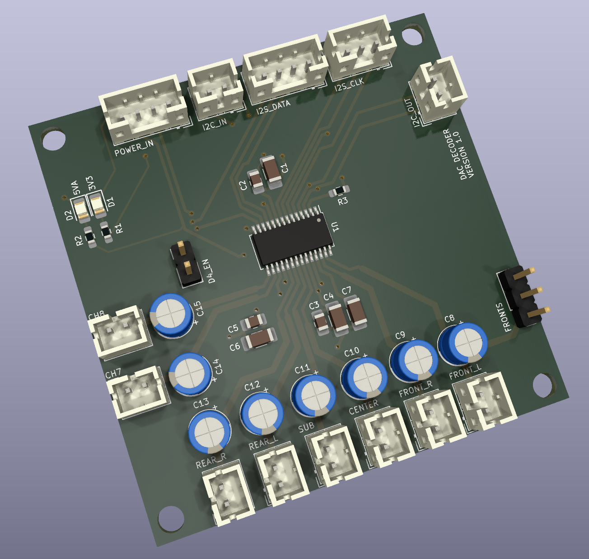

# Digital To Analog Converter

This PCB is based on the 8 channel Burr Brown PCM1681 IC.  It converts the I2S streams from the Dolby Digital Decoder PCB into 5.1 channel audio for the amplifier.

## Version History

- 1.0: Initial Release

## Speciality Components

* PCM1681 Burr Brown DAC
* Nichicon Muse ES 25V 10uF bi-polar capacitors

