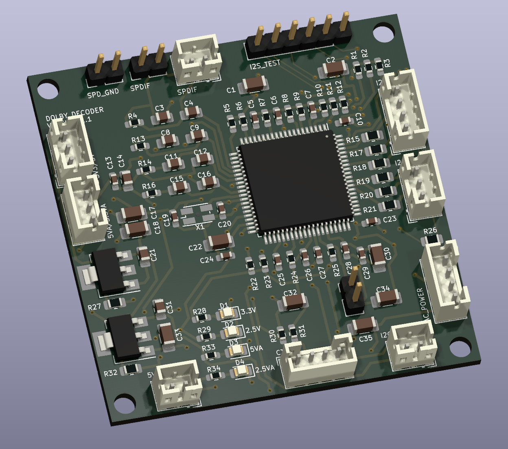

# Dolby Digital Decoder

This PCB decoders a SPDIF Dolby Digital 5.1 or PCM stream.  It is based on the STA310 set-top box Dolby Digital Decoding IC.

## Version History

- 1.0: Initial Release

## Speciality Components

* STA310 Dolby Digital Decoding IC
* 27 MHz Clock
* 2.5V 3-pin regulators

