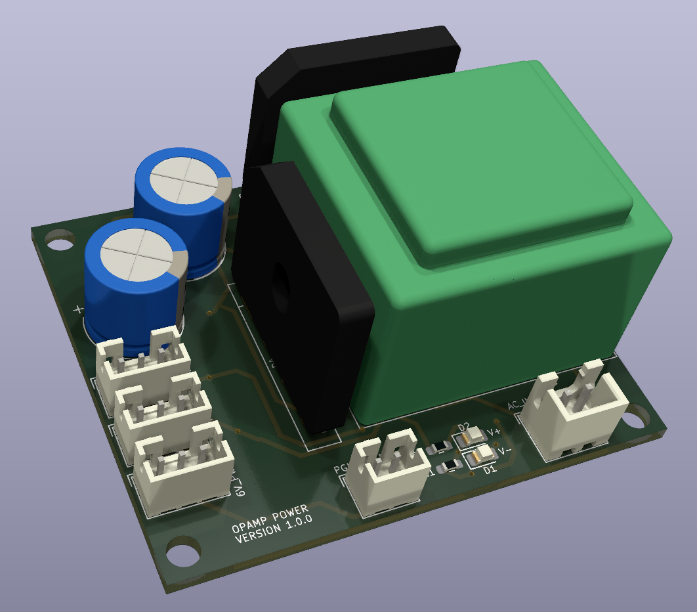

# Analog Power Supply for Operation Amplifier

This board produces a +/- 6.5V supply to be used with the DAC filter and the phono RIAA/pre-amplifier PCBs

## Version History

- 1.0: Initial Release

## Speciality Components

* LM317 & LM337 variable voltage regulators
* Myrra 44091 1.5VA +/- 6V transformer
