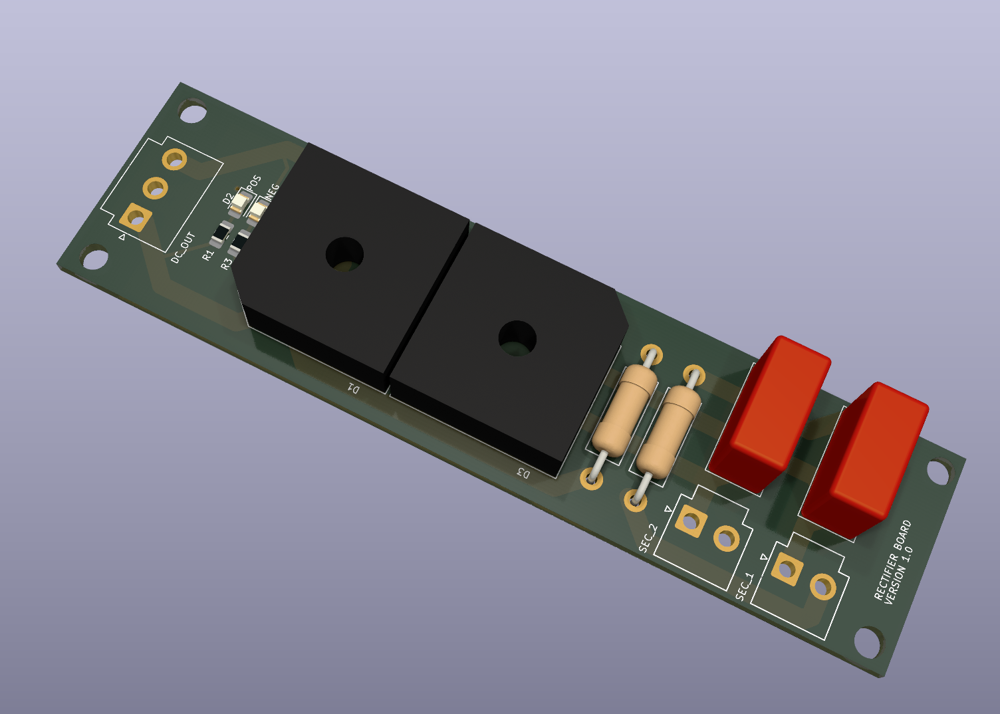

# Main Rectifier

This board takes the output from the toroid transformer and converts it into DC voltage to use with the channel amplifiers.  This was separated out
to free up room on the main power supply board with the capacitor bank, and also allows easy changes in the future to alterate rectification configurations such
as an ideal diode bridge.

## Version History

- 1.0: Initial Release

## Speciality Components

* MP1010G-G 1000V/10A bridge rectifier
* 100nF WIMA snubber capacitor
